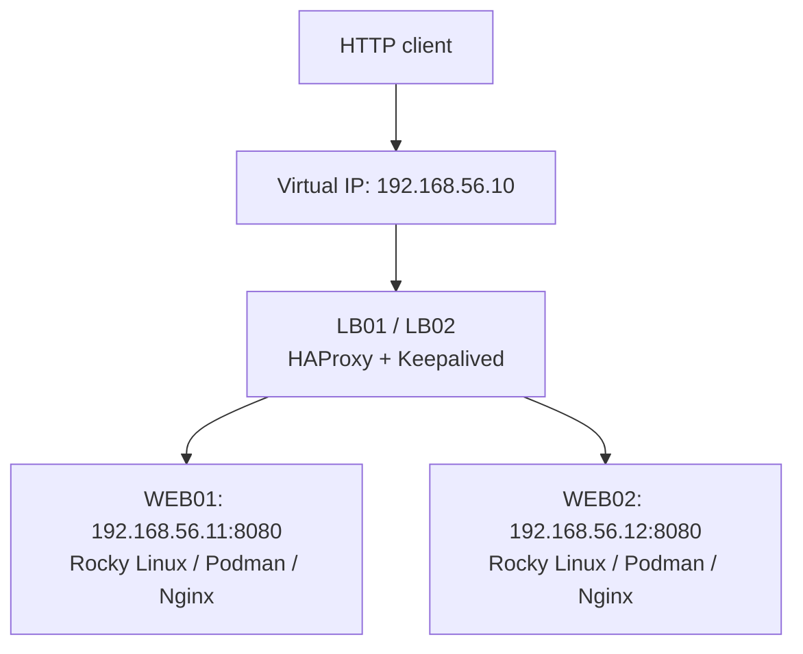
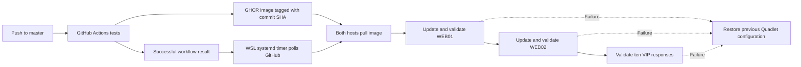

# HA Lab CI/CD

[](https://github.com/Arthur-Gusmao/ha-lab-cicd/actions/workflows/ci.yml)
[](LICENSE)

A hands-on infrastructure lab combining load balancing, containerized web
servers, GitHub Actions, and automatic deployment from WSL Debian.

**Demonstrated outcome:** a change pushed to `master` was tested, published as a
container image, and deployed to both web servers without manual commands on
the servers. [Read the recorded evidence](docs/validation.md).

## Architecture



The VIP belongs to the active load balancer. This diagram describes the lab
topology; it does not claim that failover has been tested.

## From commit to deployment



- **CI:** tests the deployment controller, builds the Nginx image, and compares
  its HTTP response with the committed `index.html`.
- **Publication:** successful master builds push the tested image to GHCR with
  the full commit SHA as its tag. Pull requests do not publish images.
- **CD:** a local WSL timer checks approximately every five minutes. Only a
  successful push workflow for the current master commit qualifies.
- **Deployment:** SSH runs a locally installed script on each web host. Both
  pulls must resolve to the same digest, which is written into Podman Quadlet.
- **Recovery:** changed hosts are restored after deployment validation failure;
  interrupted transactions are recovered on the next invocation.

The controller is not a GitHub self-hosted runner and does not automatically
download new controller code. Windows, WSL, and the lab VMs must be available.

## Explore the project

- [Architecture and design](docs/architecture.md)
- [Recorded validation](docs/validation.md)
- [Five-minute presentation and demonstration](docs/demo.md)
- [Deployment installation and operations](deploy/README.md)
- [Reproduction scope and next steps](docs/reproduction.md)
- [Contribution guide](CONTRIBUTING.md)

```text
.github/workflows/ci.yml   Tests, container build, HTTP check, GHCR publication
deploy/                   Local CD controller, remote script, installer, tests
docs/                     Architecture, evidence, demo, reproduction scope
Containerfile             Nginx application image
index.html                Static web application
LICENSE                   MIT license
```

## Run the application locally

Requires Git, Podman, and an available local TCP port 8080.

```bash
git clone https://github.com/Arthur-Gusmao/ha-lab-cicd.git
cd ha-lab-cicd
podman build -f Containerfile -t localhost/ha-webapp:local .
podman run --rm -d --name ha-webapp -p 127.0.0.1:8080:80 localhost/ha-webapp:local
curl --fail http://127.0.0.1:8080/
podman stop ha-webapp
```

Docker may be used in place of Podman for these local commands.

## Run controller tests

```bash
python3 -m unittest discover -s deploy -p 'test_*.py' -v
```

## Current limits

Host provisioning and HAProxy/Keepalived configuration are not yet included.
Sequential restarts do not guarantee zero dropped requests: connection draining
is not implemented. Failover and a deliberately failed live deployment have
not been recorded as validated tests. The controller uses root SSH in this lab;
a restricted deployment account is a planned improvement.

The HTTP check is designed for this static application. The `Already deployed`
message reads local deployment state; it is not a continuous health check.

## License

Code and documentation are available under the [MIT License](LICENSE).
